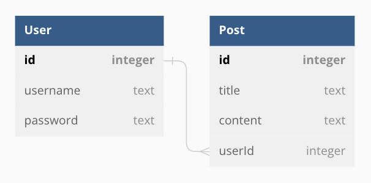

# Block 34D - Improved Juicebox

For this project, you will be recreating the Juicebox API from scratch with the new technologies you've learned. You may structure your project as you wish as long as you meet the requirements. Feel free to use one of the previous workshop solutions as reference! Before you start, make sure to read through the rubric to get a sense of what you will be required to do.

## Database

Run `createdb 34d-juicebox` to create the database that you will be using for this assignment.

Your Prisma schema should define the two models as described below in [DBML](https://dbml.dbdiagram.io/docs).



```dbml
Table User {
  id integer [pk, unique, increment]
  username text [unique]
  password text
}

Table Post {
  id integer [pk, unique, increment]
  title text
  content text [note: 'Content of the post']
  userId integer [ref: > User.id]
}
```

You should also have a seed file that seeds the database with _at least_ 3 users. Each user should have _at least_ 3 posts. You can either hard code the initial data or use a library like [Faker](https://fakerjs.dev/) to generate the data.

## API

Your API should provide the following endpoints. You should be using Express with Prisma Client.

Write the **tests** for these endpoints _before_ you start writing the endpoints! For this project, you are only required to test the Express endpoints. You do not need to mock Prisma.

These authentication endpoints should handle username/password credentials. You _do not_ need to integrate OAuth.

- `POST /auth/register` - create a new User with the provided credentials and return a token
- `POST /auth/login` - login with the provided credentials and return a token

These endpoints can be accessed by anyone.

- `GET /api/posts` - get all posts
- `GET /api/posts/:id` - get the post specified by id

These endpoints can only be accessed if a valid token is provided in the request headers. If a token is not provided, then the response should always be status 401.

- `POST /api/posts` - create a new post as the currently logged in user
- `PUT /api/posts/:id` - update a post only if it was created by the currently logged in user
- `DELETE /api/posts/:id` - delete a post only if it was created by the currently logged in user

## Submission

Please submit a link to your Github repo.
